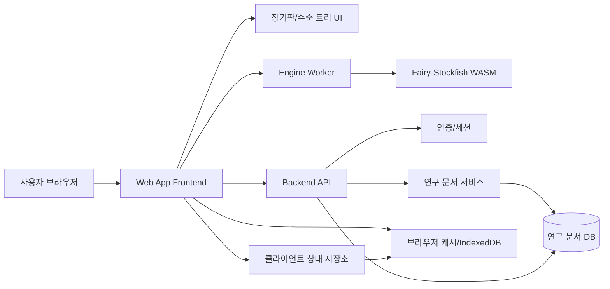
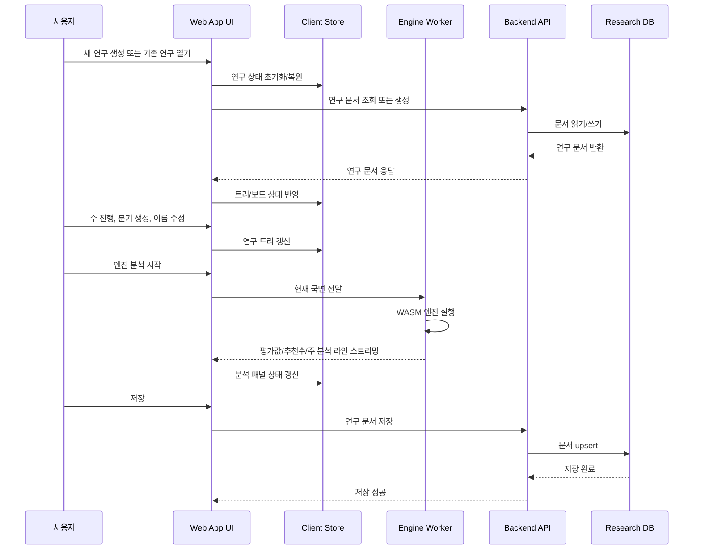
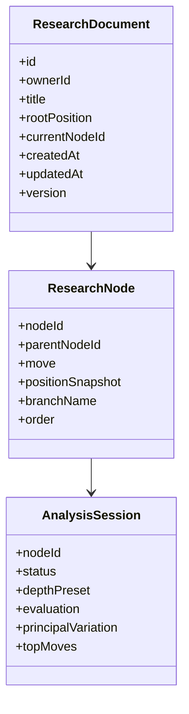
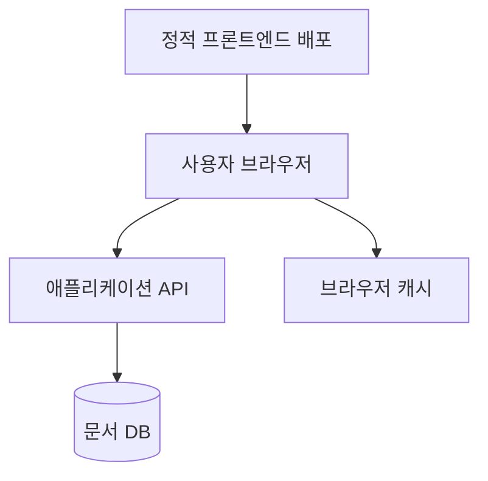

# 한국 장기 연구 웹앱 서비스 아키텍처

## 1. 아키텍처 목표

이 제품의 핵심은 `장기판 UI`가 아니라 `이름이 붙은 연구 트리`와 `브라우저 안에서 끝나는 엔진 분석`이다. 따라서 아키텍처도 다음 원칙을 기준으로 잡는다.

- 연구 데이터는 서버가 관리하되, 엔진 분석 국면과 결과는 서버에 보내지 않는다.
- 제품의 중심 도메인은 `게임 진행`이 아니라 `연구 문서`다.
- MVP는 협업, 공유, 실시간 동기화보다 `안정적인 단독 연구 흐름`에 집중한다.
- 저사양 환경과 엔진 초기 다운로드 비용을 고려해, 분석 기능은 비동기·취소 가능·점진적 로딩 구조로 설계한다.

## 2. 권장 전체 구조

### 구조 설명

- `Web App Frontend`
  사용자가 실제로 상호작용하는 앱 레이어다. 장기판, 분기 트리, 엔진 패널, 저장/불러오기 흐름을 묶는다.

- `장기판/수순 트리 UI`
  말 이동, 합법 수 검증 결과 반영, 분기 생성, 분기 이름 편집, 현재 경로 하이라이트를 담당한다. 사용자가 느끼는 제품 가치 대부분이 이 계층에서 결정된다.

- `클라이언트 상태 저장소`
  현재 연구 문서, 선택된 노드, 엔진 실행 상태, 저장 상태, 최근 열람 상태를 보관한다. 보드 UI와 분석 UI를 느슨하게 연결하는 허브 역할을 한다.

- `Engine Worker`
  메인 UI 스레드와 분리된 분석 실행 계층이다. 분석 시작, 중지, 깊이 변경, 결과 스트리밍을 처리한다.

- `Fairy-Stockfish WASM`
  실제 장기 분석 엔진이다. 브라우저 내부에서만 실행되며 서버 비용과 개인정보 전송을 줄이는 대신, 기기 성능 차이를 그대로 받는다.

- `Backend API`
  연구 문서 저장과 사용자 인증만 책임진다. MVP에서는 엔진 분석 API를 두지 않는다.

- `연구 문서 서비스`
  연구 생성, 저장, 불러오기, 최근 문서 목록, 문서 메타데이터 갱신을 담당하는 백엔드 도메인 계층이다.

- `연구 문서 DB`
  연구 트리와 문서 메타데이터를 저장한다. 분석 결과 영구 저장은 MVP 범위에서 제외하거나 최소화한다.

- `브라우저 캐시/IndexedDB`
  엔진 WASM 파일 캐시, 마지막 열람 위치, 임시 저장, 최근 문서 메타를 보관하는 로컬 저장소다.

## 3. 사용자 흐름 기준 아키텍처

### 흐름 설명

- 연구 문서는 백엔드 기준으로 불러오고 저장한다.
- 연구 중 발생하는 대부분의 인터랙션은 클라이언트 상태 저장소 안에서 처리한다.
- 엔진 분석은 브라우저 안에서만 실행하고, UI는 Worker에서 오는 결과를 스트리밍으로 소비한다.
- 저장은 명시 저장과 자동 임시 저장을 함께 고려하되, MVP는 명시 저장 중심으로 시작하는 편이 안정적이다.

## 4. 컴포넌트 경계와 책임

| 영역 | 책임 | 포함 기능 | 제외 기능 |
|---|---|---|---|
| 프론트엔드 앱 | 사용자 상호작용 오케스트레이션 | 보드, 트리, 분석 패널, 문서 편집 | 엔진 계산, 영구 저장 책임 |
| 게임 규칙 모듈 | 장기 규칙과 국면 변환 | 합법 수, 기물 배치, FEN 유사 포맷 변환 | 저장 API 호출 |
| 연구 트리 모듈 | 연구 문서 핵심 도메인 | 노드/분기 CRUD, 이름 변경, 현재 경로 이동 | 인증, 외부 공유 |
| 엔진 어댑터 | Worker와 엔진 연결 | 시작/중지, 결과 파싱, 프리셋 적용 | 서버 분석 큐 |
| 백엔드 API | 계정/문서 영속화 | 로그인, 연구 저장/조회, 최근 문서 | 엔진 계산, 실시간 협업 |
| 저장소 계층 | 문서 영속화 | 문서 버전, 메타데이터, 인덱싱 | 분석 로그 대량 보관 |

## 5. 데이터 구조 권장안

### 데이터 설명

- `ResearchDocument`
  저장과 불러오기의 최상위 단위다. 제목, 소유자, 루트 국면, 현재 열람 위치를 가진다.

- `ResearchNode`
  수순 트리의 실제 노드다. 부모-자식 관계와 분기 이름을 가진다. MVP에서는 메모보다 `branchName`을 우선 지원한다.

- `AnalysisSession`
  영구 저장 대상이라기보다 화면 상태에 가까운 데이터다. 기본 원칙은 휘발성 관리이며, 필요 시 마지막 결과만 로컬 캐시에 남긴다.

## 6. 배포 구조 권장안

### 배포 설명

- 프론트엔드는 정적 자산 중심으로 CDN 배포가 적합하다.
- 엔진 WASM도 프론트엔드 자산처럼 배포하되, 버전 고정과 캐시 정책이 중요하다.
- 백엔드는 인증과 문서 저장 API만 제공하는 얇은 계층으로 유지한다.
- 이 구조는 운영 표면적이 작고, MVP에 필요한 안정성 대비 구현 복잡도가 낮다.

## 7. 기술 선택 권장안

- 프론트엔드: React + TypeScript
- 상태 관리: 클라이언트 전역 상태 저장소 1개 + 도메인 모듈 분리
- 보드 렌더링: Canvas 또는 SVG 기반 커스텀 보드
- 엔진 실행: Web Worker + Fairy-Stockfish WASM
- 로컬 저장: IndexedDB
- 백엔드: REST API
- DB: 문서형 저장소 또는 JSON 구조를 다루기 쉬운 관계형 DB

### 선택 이유

- 연구 트리는 계층형 데이터라 JSON 친화 구조가 유리하다.
- 엔진은 실시간 스트리밍 결과를 주므로 Worker 메시지 인터페이스가 적합하다.
- MVP는 관리 포인트를 줄여야 하므로 WebSocket이나 서버 분석 큐보다 REST + 로컬 Worker가 단순하다.

## 8. capability map과 ownership

| capability | 주 소유 영역 | 비고 |
|---|---|---|
| 장기 규칙 처리 | 프론트엔드 도메인 모듈 | 분석 엔진 입력과 동일 규칙을 써야 함 |
| 보드 상호작용 | 프론트엔드 UI | 모바일보다 데스크톱 우선 |
| 연구 트리 관리 | 프론트엔드 + 백엔드 문서 모델 | 저장 포맷 안정성이 중요 |
| 분기 이름 편집 | 프론트엔드 UI | 제품 차별점 핵심 |
| 엔진 분석 실행 | 클라이언트 Worker | 서버 비의존 원칙 유지 |
| 엔진 자산 배포 | 프론트엔드 배포 파이프라인 | 버전/캐시 무효화 필요 |
| 로그인/세션 | 백엔드 API | MVP 범위에 따라 익명 로컬 우선 가능 |
| 연구 저장/복원 | 백엔드 API + DB | 문서 버전 호환 필요 |
| 최근 문서/재개 | 백엔드 + 로컬 캐시 | UX 향상 포인트 |
| 관측성/오류 수집 | 프론트엔드 + 백엔드 공통 | 엔진 초기화 실패 추적 중요 |

## 9. 가장 작은 일관된 MVP 아키텍처

MVP에서는 다음만 유지하는 것이 맞다.

- 프론트엔드 단일 웹앱
- Web Worker 기반 클라이언트 엔진 분석
- 연구 문서 저장용 단순 백엔드 API
- 문서 1개 단위 저장 포맷
- 최근 문서와 엔진 캐시를 위한 브라우저 로컬 저장

다음은 의도적으로 넣지 않는다.

- 서버 분석 워커
- 실시간 협업
- 공유 링크 권한 모델
- 복잡한 문서 버전 브랜칭
- 태그/검색/커뮤니티 라이브러리

## 10. 최고 위험 설계 트레이드오프

### 1. 클라이언트 엔진만 사용

- 장점: 서버 비용 절감, 분석 국면 비전송, MVP 속도 향상
- 단점: 저사양 기기 성능 편차, 브라우저 호환성 이슈, 초기 다운로드 부담

### 2. 연구 트리를 문서 단위로 통저장

- 장점: 구현 단순, 복원 정확성 높음, API 설계 단순
- 단점: 문서가 커질수록 저장 payload 증가, 세밀한 충돌 제어 어려움

### 3. REST 중심 저장 구조

- 장점: 운영 단순, 디버깅 용이, MVP 적합
- 단점: 협업/스트리밍 기능으로 확장 시 재설계 가능성 존재

### 4. 메모보다 분기 이름 우선

- 장점: 제품 차별점에 집중, UI 단순화
- 단점: 심화 연구 사용자에게 기록 표현력이 부족할 수 있음

## 11. 단계별 롤아웃 가이드

### Phase 1. 엔진 PoC

- Fairy-Stockfish WASM 초기화 가능 여부 검증
- 기준 브라우저에서 첫 결과 시간 측정
- Web Worker 중지/재시작 안정성 검증

### Phase 2. 연구 문서 모델 확정

- `ResearchDocument`와 `ResearchNode` JSON 스키마 고정
- 저장/복원 시 동일 트리 재현 검증
- 분기 이름 수정과 노드 이동 규칙 확정

### Phase 3. 단독 연구 MVP

- 새 연구, 수 진행, 분기 생성, 이름 편집
- 분석 시작/중지, 추천수 표시
- 저장/불러오기, 최근 문서 재개

### Phase 4. 안정화

- 엔진 실패/초기 다운로드 오류 대응
- 저장 실패 재시도
- 문서 크기와 성능 모니터링

### Phase 5. 차기 확장

- 노드 메모
- 공유 링크
- 정석 템플릿
- 이후 필요 시 협업 구조 재검토

## 12. 운영과 지원 관점

- 가장 먼저 모니터링할 대상은 `엔진 초기화 실패율`, `첫 분석 결과 시간`, `문서 저장 실패율`이다.
- 지원 시나리오는 기능 버그보다 `브라우저 성능 차이`와 `캐시 손상`에서 많이 나올 가능성이 높다.
- 엔진 버전 업그레이드는 문서 저장 구조와 분리해 배포해야 한다.
- 롤백은 `프론트엔드 번들`, `WASM 엔진 자산`, `API 스키마`를 각각 독립적으로 되돌릴 수 있어야 한다.

## 13. 검증이 필요한 가정

- 사용자가 실제로 `분기 이름`만으로도 연구를 충분히 관리할 수 있는가
- 장기 연구 세션 평균 길이에서 문서 단위 저장이 성능상 충분한가
- 대상 사용자 기기에서 WASM 엔진 초기화 시간이 허용 가능한가
- 익명 로컬 저장보다 로그인 기반 클라우드 저장이 MVP 전환율에 더 중요한가
- 사용자가 리스트형 수순보다 트리형 시각화를 더 잘 이해하는가

## 14. 최종 권고

이 제품은 멀티서비스 구조보다 `가벼운 웹앱 + 얇은 저장 API + 브라우저 엔진` 조합이 맞다. 핵심은 서비스 수를 늘리는 것이 아니라, 연구 트리와 엔진 분석의 경계를 명확히 유지하는 것이다.

초기에는 서버를 문서 저장 계층으로만 제한하고, 분석은 끝까지 클라이언트에 남겨야 한다. 그렇게 해야 제품의 차별점과 운영 단순성을 동시에 확보할 수 있다.
